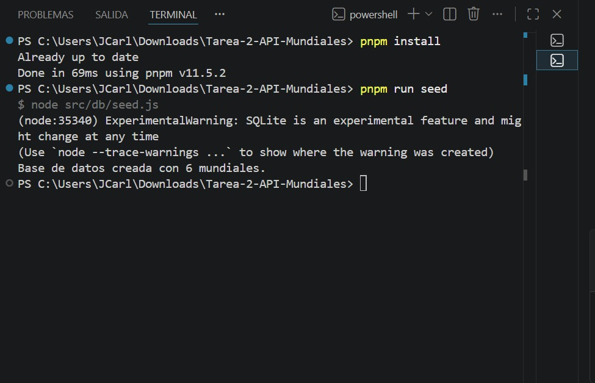

# Capturas de pruebas

## Instalación y seed

## Servidor corriendo

## GET /mundiales

## GET /mundiales?include=full

## GET /mundial/:slug

## GET /mundial/:slug — 404

## GET /random

## GET /campeon/:pais

## GET /campeon/:pais (Brasil)

## GET /search/:text

## GET /search/:text (qatar)

## GET /search/:text — 400 (texto muy corto)

